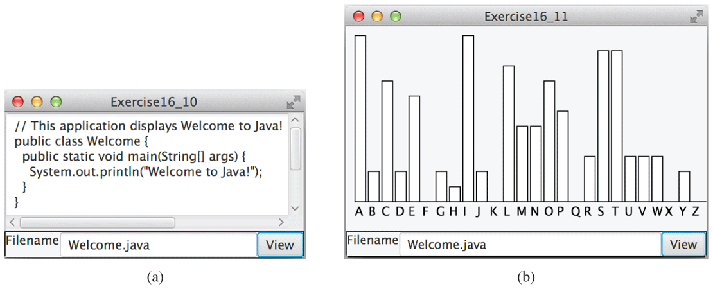

# Lab 7  

  ## Due Thursday, Nov. 3, 2022 at 11:59pm
  One submission per group. Put all members' names in the source code for the main class as a comment field.
  
  1. Examine this starting code and the other examples on Replit.
  2. In this lab, your group must create a JavaFX application that will display a text area with text read in from a file. There should be at least 1 text area, 1 text field and 1 button, as shown in the figure below. In this figure, the user would first type in the name of a file, the press the *View* button to load it. Exceptions should be handled to gracefully recover with popup messages if the file does not exist or cannot be loaded.
  3. Extend this GUI so that a histogram of occurrences for each letter from the file (case insensitive) is shown as in the figure provided. In your GUI, make it so the text area is at the top, the histogram is in the center and the filename label, textfield and button are at the bottom.

Be creative in your look and feel. The images provided are just for reference to show the functionality. Play around with the formatting to make it look aesthetically pleasing. 

  

  __Resources__: 
  
  Bar Charts: https://www.tutorialspoint.com/javafx/bar_chart.htm \
  Text Areas: https://www.tutorialspoint.com/how-to-create-a-text-area-in-javafx \
  Buttons: https://www.javatpoint.com/javafx-button \
  VBox Panes: https://www.tutorialspoint.com/javafx/layout_panes_vbox.htm \
  HBox panes: https://www.tutorialspoint.com/javafx/layout_panes_hbox.htm
  
  